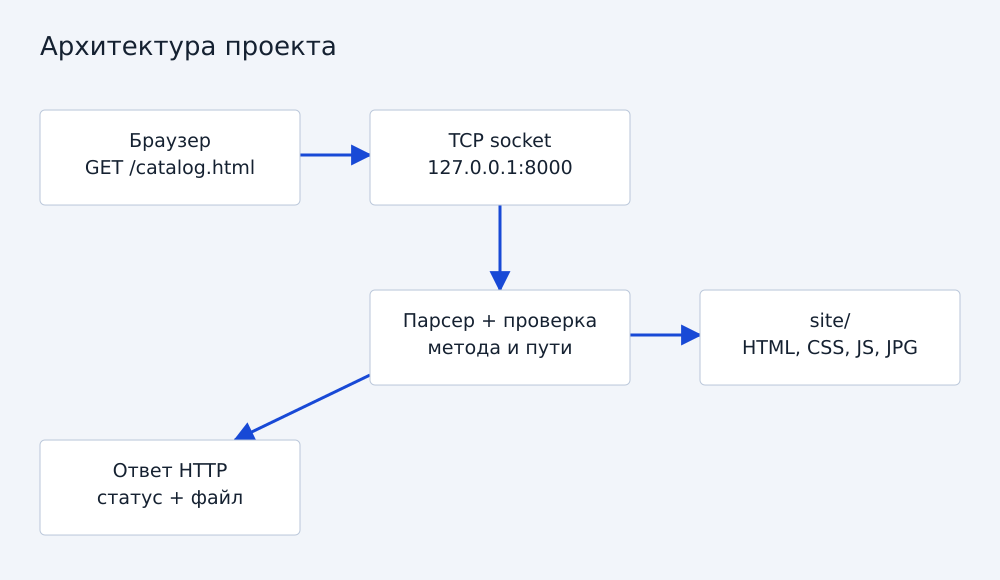
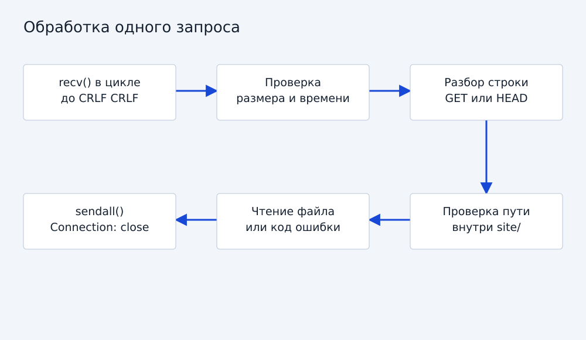
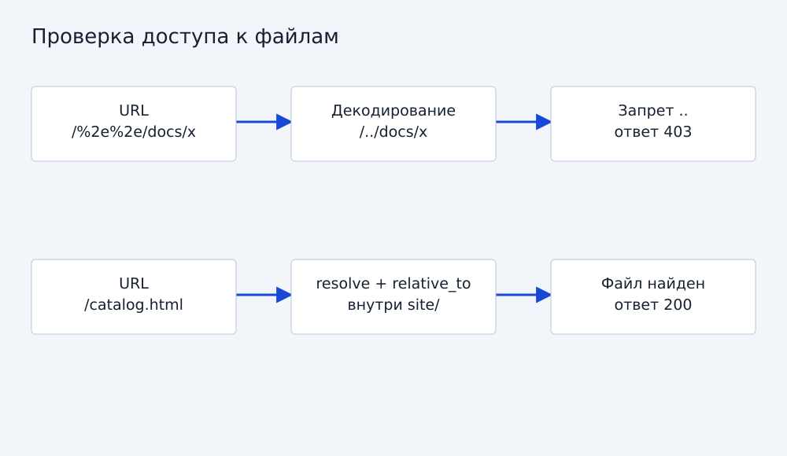

# HTTP-сервер с нуля: техническое руководство

## 1. Задача и выбор технологии
Вариант 2.2: реализовать небольшой HTTP-сервер, который обслуживает сайт магазина одежды. Используется Python 3.9+ и стандартная библиотека. Модуль socket предоставляет доступ к TCP; готовые серверные классы http.server и веб-фреймворки не используются. «С нуля» относится к обработке HTTP поверх предоставленного ОС TCP, а не к собственной реализации TCP/IP.

Аналоги: python -m http.server быстро раздаёт файлы, Flask удобен для приложений, nginx рассчитан на промышленное обслуживание. Для изучения запросов и ответов выбран собственный последовательный обработчик. Его нельзя считать заменой этим продуктам.



## 2. Подготовка и структура
Установить Python 3.9 или новее. Дополнительные pip-пакеты для запуска проекта не нужны. Создать рядом папки site, src и tests. HTML, CSS, JavaScript и изображения находятся в site. Основной код — src/server.py.

```bash
py --version
py src/server.py
```

Открыть http://127.0.0.1:8000. Чтобы остановить процесс, нажать Ctrl+C. При занятом порте запустить py src/server.py --port 8001. На Linux и macOS использовать python3 вместо py. Корень site вычисляется от расположения server.py, поэтому не зависит от текущей рабочей директории.

## 3. TCP-соединение
В функции main создаётся AF_INET / SOCK_STREAM-сокет. bind связывает его с 127.0.0.1 и выбранным портом; listen включает ожидание. accept возвращает отдельный сокет клиента. После обработки одного запроса соединение закрывается.

```python
with socket.socket(socket.AF_INET, socket.SOCK_STREAM) as server:
    server.bind(('127.0.0.1', 8000))
    server.listen(8)
    conn, address = server.accept()
    with conn:
        handle(conn)
```

Это сокращённая иллюстрация. В итоговом main есть цикл, параметры командной строки и остановка Ctrl+C. Адрес loopback ограничивает доступ текущим компьютером.

## 4. Сборка заголовка из потока
TCP не сохраняет границы HTTP-сообщений. Один recv может вернуть только часть заголовка, поэтому read_header накапливает байты до последовательности CRLF CRLF. Заголовок ограничен 16384 байтами; общий срок ожидания — 5 секунд, он не сбрасывается после каждого байта.

```python
data.extend(chunk)
end = data.find(b'\r\n\r\n')
```

Превышение размера даёт 431, таймаут — 408, обрыв неполного запроса — 400. Сервер принимает только запросы без тела. Это упрощает границы сообщения; keep-alive и pipeline не поддерживаются.



## 5. Разбор HTTP
Первая строка имеет вид GET /catalog.html HTTP/1.1. parse_request проверяет число частей и версию HTTP/1.0 или HTTP/1.1. Для HTTP/1.1 обязателен Host. Дубли заголовков и некорректные имена отклоняются в рамках упрощённой модели.

GET возвращает файл. HEAD формирует тот же ответ, но не отправляет тело. Другие методы получают 405 и Allow: GET, HEAD. Transfer-Encoding и ненулевой Content-Length отклоняются, поскольку входящее тело не обрабатывается.

## 6. Безопасное преобразование URL в путь
Сначала отделяется query string, затем выполняется однократное декодирование percent-encoding. Проверяется корректность процентов и UTF-8. Запрещены управляющие символы, обратные слеши, двоеточия, скрытые сегменты и .. . Далее resolve нормализует путь, включая символические ссылки, а relative_to проверяет принадлежность корню site.

```python
path = (root / raw.lstrip('/')).resolve()
try:
    path.relative_to(root)
except ValueError:
    raise RequestError(403)
```

Для каталога проверяется index.html, также после разрешения символических ссылок. Нельзя обслуживать весь репозиторий, поскольку тогда документы и исходный код окажутся доступны через HTTP. Тест проверяет как обычное ../, так и /%2e%2e/.



## 7. HTTP-ответ
response формирует строку статуса и заголовки Content-Type, Content-Length, Connection: close, X-Content-Type-Options и Cache-Control. Длина вычисляется по байтам, не по числу символов: это важно для кириллицы. sendall отправляет весь переданный буфер или сообщает об ошибке.

```python
fields = [f'HTTP/1.1 {status} {STATUS[status]}',
          f'Content-Length: {len(body)}', 'Connection: close']
# В полном коде также задаются Content-Type и другие заголовки.
```

Статический файл читается как bytes, поэтому изображения не повреждаются. Выдача ограничена 16 MiB на файл. Для HTML/CSS/JS типы заданы явно; иначе используется mimetypes или application/octet-stream.

## 8. Модификация относительно минимального сервера
Базовый вариант мог возвращать один фиксированный HTML-ответ. В итоговую реализацию добавлены выдача нескольких файлов, MIME-типы, HEAD, страница ошибки, разбор query string, локальный корень, защита путей и символических ссылок, лимиты времени и памяти, настройка порта, логирование и автоматические тесты.

Для сайта добавлена клиентская фильтрация и сортировка каталога. Статические карточки находятся в HTML: при отключении JavaScript каталог остаётся читаемым.

## 9. Проверки
```bash
py -m unittest discover -s tests -v
```

Тесты поднимают реальный loopback TCP-сокет во временном каталоге, отправляют запросы и сравнивают HTTP-ответы. Проверяются кириллица и байтовая длина, CSS, бинарные файлы, GET, HEAD, query string, 404, 405, выход за корень, скрытые файлы, неверное кодирование, отсутствие Host, неполный заголовок, ограничение размера и запрет тела.

В среде подготовки 05.09.2026 успешно выполнен 21 тест. На Windows тест символической ссылки может быть пропущен, если ОС не разрешает её создавать. Это не следует выдавать за проверенную защиту в данной среде: остальные тесты остаются обязательными.

## 10. Ограничения и развитие
Сервер обрабатывает клиентов последовательно, поэтому медленный запрос временно задерживает остальных. Нет TLS, POST, Range, gzip, keep-alive и полноценного RFC-парсера. Возможна гонка между проверкой пути и открытием файла, если другой локальный процесс одновременно заменяет файлы или ссылки. Корень должен оставаться доверенным и неизменяемым во время демонстрации. Код предназначен для localhost, а не для публичного размещения.

Дальнейшее развитие: пул обработчиков с лимитом, журнал в файл, кеширование и выделение парсера. Эти возможности не заявляются реализованными.

## 11. Источники и полный код
[Python socket](https://docs.python.org/3/library/socket.html), [urllib.parse](https://docs.python.org/3/library/urllib.parse.html), [RFC 9110](https://www.rfc-editor.org/rfc/rfc9110.html), [RFC 9112](https://www.rfc-editor.org/rfc/rfc9112.html).

Полная реализация: [server.py](server.py.txt). Проверки: [test_server.py](test_server.py.txt). Код и текст подготовлены с помощью ChatGPT; перед защитой участникам необходимо самостоятельно проверить и объяснить решения.
